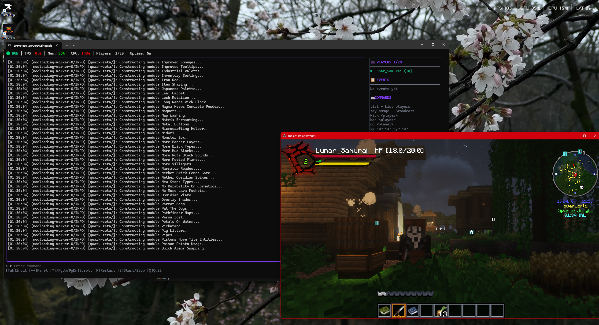
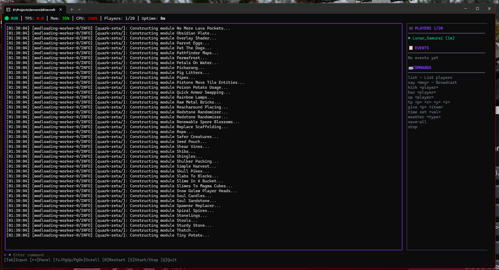

# 🎮 Minecraft EZ-PZ Server Manager - For Da Bois

A high-performance, feature-rich Minecraft server manager written in Go with a beautiful terminal UI, CurseForge modpack support, and comprehensive server management features. All you need is a directory called /server, unzip your modpack in there, and run this bad boy against that.... just like that... EZ PZ




---

## 📥 Download

<p align="left">
  <a href="https://github.com/LunarSamurai/Minecraft-Ez-PZ-Server-Auto-Ingestor/tree/main/releases/latest/download/mcserver-ez-pz.exe">
    
  </a>
  &nbsp;&nbsp;
  <a href="https://github.com/LunarSamurai/Minecraft-Ez-PZ-Server-Auto-Ingestor/tree/main/releases/latest/download/mcserver">
    
  </a>
  &nbsp;&nbsp;
  <a href="https://github.com/LunarSamurai/Minecraft-Ez-PZ-Server-Auto-Ingestor/tree/main/releases/latest/download/mcserver">
    
  </a>
</p>

---

## 🚀 Quick Start Guide

### Step 1: Create Your Folder Structure

```
📁 MyMinecraftServer/
├── 📄 mcserver-ez-pz.exe    ← Put the downloaded file here
└── 📁 server/               ← Create this folder
    └── 📦 (your modpack)    ← Unzip your server pack here
```

### Step 2: Download Your Server Modpack

1. Go to [CurseForge](https://www.curseforge.com/minecraft/modpacks)
2. Find your modpack and download the **Server Pack** (not the client!)
3. Unzip the server pack contents into the `server/` folder

### Step 3: Run It!

**Windows:**
```powershell
.\mcserver-ez-pz.exe --ram-min 2G --ram-max 8G --server-dir ./server
```

**Linux/macOS:**
```bash
./mcserver --ram-min 2G --ram-max 8G --server-dir ./server
```

That's it! **EZ PZ** 🎉

---

## 📋 Detailed Setup Instructions

### For Windows Users

1. **Create a new folder** anywhere on your computer (e.g., `C:\Games\MyMinecraftServer`)

2. **Download** `mcserver-ez-pz.exe` using the button above and put it in that folder

3. **Create a `server` folder** inside your main folder:
   ```
   C:\Games\MyMinecraftServer\
   ├── mcserver-ez-pz.exe
   └── server\
   ```

4. **Download your modpack's server files** from CurseForge:
   - Go to your modpack page
   - Look for "Server Pack" or "Server Files" in the downloads
   - Download the ZIP file

5. **Extract the server pack** directly into the `server` folder:
   ```
   C:\Games\MyMinecraftServer\
   ├── mcserver-ez-pz.exe
   └── server\
       ├── mods\
       ├── config\
       ├── libraries\
       ├── run.sh
       └── ... (other modpack files)
   ```

6. **Open PowerShell/Terminal** in your main folder and run:
   ```powershell
   .\mcserver-ez-pz.exe --ram-min 2G --ram-max 10G --server-dir ./server
   ```

### For Linux/macOS Users

```bash
# Create folder structure
mkdir -p ~/minecraft-server/server

# Download the binary (or build from source)
cd ~/minecraft-server

# Make it executable
chmod +x mcserver

# Extract your server modpack into ./server/

# Run it
./mcserver --ram-min 2G --ram-max 8G --server-dir ./server
```

---

## ⚠️ Requirements

| Requirement | Details |
|-------------|---------|
| **Java** | Java 17 or later ([Download from Adoptium](https://adoptium.net/temurin/releases/?version=17)) |
| **RAM** | Minimum 4GB free, 8GB+ recommended for modpacks |
| **OS** | Windows 10/11, Linux, or macOS |

### Java Installation

Make sure Java 17 is installed and in your PATH:

```bash
java -version
# Should show: openjdk version "17.x.x" or similar
```

If you have multiple Java versions, specify the path:

```powershell
.\mcserver-ez-pz.exe --java "C:\Program Files\Java\jdk-17\bin\java.exe" --ram-max 8G --server-dir ./server
```

---

## ✨ Features

### 🖥️ Beautiful Terminal UI



- Real-time server statistics dashboard
- TPS, memory, CPU, and bandwidth monitoring
- Player list with join times and session duration
- Color-coded event log (joins, leaves, warnings, errors)
- Interactive console with command input
- Responsive layout that adapts to terminal size

### 📦 CurseForge Integration

- Download modpacks directly by project ID or name
- Automatic server pack detection and installation
- Supports Forge, Fabric, and NeoForge mod loaders

### 🔧 Server Management

- Graceful shutdown with save-all
- Auto-restart on crash
- Optimized JVM flags (Aikar's flags)
- Automatic EULA acceptance

### 💾 Backup System

- Scheduled world backups
- Configurable backup interval
- Automatic cleanup of old backups

### 📊 Statistics Tracking

- TPS (Ticks Per Second) monitoring
- Memory usage with progress bars
- CPU utilization tracking
- Network bandwidth (in/out)
- Player count and session times

---

## 🎮 TUI Keyboard Shortcuts

| Key | Action |
|-----|--------|
| `Tab` | Toggle command input focus |
| `Enter` | Execute command (when input focused) |
| `↑/↓` | Scroll console |
| `←/→` | Switch panels |
| `End` | Resume auto-scroll |
| `R` | Restart server |
| `S` | Start/Stop server |
| `Q` | Quit application |

---

## ⚙️ Command Line Options

| Flag | Short | Default | Description |
|------|-------|---------|-------------|
| `--ram-min` | `-m` | `1G` | Minimum RAM allocation |
| `--ram-max` | `-M` | `4G` | Maximum RAM allocation |
| `--port` | `-p` | `25565` | Server port |
| `--server-dir` | `-d` | `./server` | Server directory path |
| `--java` | | `java` | Path to Java executable |
| `--auto-restart` | `-r` | `true` | Auto-restart on crash |
| `--backup-enabled` | | `false` | Enable scheduled backups |
| `--backup-interval` | | `60` | Backup interval (minutes) |
| `--no-tui` | | `false` | Disable TUI, use console mode |

---

## 🌐 Multiplayer Setup

### Option 1: Port Forwarding

Forward port `25565` on your router and share your public IP.

### Option 2: Playit.gg (Recommended - No Port Forward!)

1. Download [Playit.gg](https://playit.gg/)
2. Run the Playit agent
3. Create a Minecraft tunnel
4. Share the `xxxxx.playit.gg` address with friends

Your friends need to install the **same modpack client version** to connect!

---

## 🔨 Building from Source

```bash
# Clone the repository
git clone https://github.com/YOUR_USERNAME/mcserver-manager.git
cd mcserver-manager

# Build
go build -o mcserver-ez-pz.exe .   # Windows
go build -o mcserver .              # Linux/macOS
```

---

## 🐛 Troubleshooting

<details>
<summary><b>Server won't start</b></summary>

- Check Java version: `java -version` (needs 17+)
- Make sure server files are in the `server/` directory
- Check if port 25565 is already in use

</details>

<details>
<summary><b>Java version issues</b></summary>

If you have multiple Java versions:

```powershell
.\mcserver-ez-pz.exe --java "C:\Program Files\Java\jdk-17\bin\java.exe" --server-dir ./server
```

</details>

<details>
<summary><b>Out of memory errors</b></summary>

Increase RAM allocation:

```powershell
.\mcserver-ez-pz.exe --ram-min 4G --ram-max 12G --server-dir ./server
```

</details>

<details>
<summary><b>TPS drops / lag</b></summary>

- Reduce `view-distance` in `server/server.properties`
- Pre-generate the world with Chunky mod
- Check for problematic mods/chunks

</details>

---

## 📄 License

MIT License - see LICENSE file for details.

## 🤝 Contributing

Contributions are welcome! Feel free to submit a Pull Request.

---

<p align="center">
  Made with ❤️ for da bois
</p>